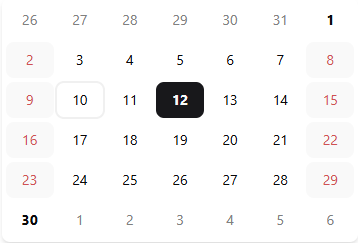
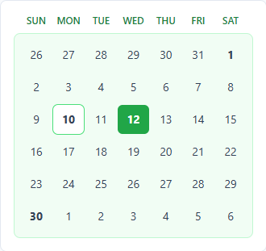
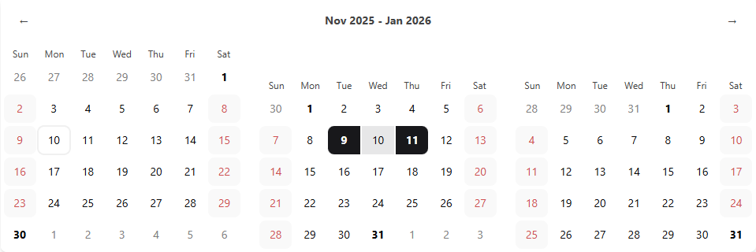

# [React Modular DatePicker](https://legeannd.github.io/react-modular-datepicker/)

<p align="center">
  
</p>

[](https://www.npmjs.com/package/@legeannd/react-modular-datepicker)
[](https://bundlephobia.com/package/@legeannd/react-modular-datepicker)
[](https://6906e222e254283f6ff8fd07-clbcgotlkj.chromatic.com/)
[](https://opensource.org/licenses/MIT)

```tsx
import * as DatePicker from '@legeannd/react-modular-datepicker'

function App() {
  return (
    <DatePicker.Provider>
      <DatePicker.Header>
        <DatePicker.Button type='previous'>←</DatePicker.Button>
        <DatePicker.Label />
        <DatePicker.Button type='next'>→</DatePicker.Button>
      </DatePicker.Header>
      <DatePicker.Calendar />
    </DatePicker.Provider>
  )
}
```

A modern, lightweight, composable datepicker library for React applications. Built with TypeScript, React 19, and CSS Modules.

**[📚 View Live Examples →](https://6906e222e254283f6ff8fd07-clbcgotlkj.chromatic.com/)**  
**[📝 Read the Docs →](https://legeannd.github.io/react-modular-datepicker/)**

## Features

- 🎯 **Modular Architecture** - Compose components to build custom date pickers
- 🎨 **Highly Customizable** - Complete styling control via CSS classes and custom properties
- 🌍 **Internationalization** - Day.js-powered localization support
- 📱 **Responsive** - Mobile-friendly with flexible layouts
- 🎭 **Multiple Selection Modes** - Single, multiple, and range selection
- 🎛️ **Controlled & Uncontrolled** - Use as controlled or uncontrolled components
- ⚡ **React Compiler Optimized** - Built for performance with React's compiler
- 📦 **TypeScript First** - Full type safety and IntelliSense

## Installation

```bash
npm install @legeannd/react-modular-datepicker
# or
pnpm add @legeannd/react-modular-datepicker
# or
yarn add @legeannd/react-modular-datepicker
```

**Peer Dependencies:** React 19+, Day.js

> **Note:** This library is optimized with React's compiler for better performance. While it works without it, we recommend setting it up. [Learn more about the React Compiler →](https://react.dev/learn/react-compiler)

> **💡 Tip:** Explore all features and styling options in our [interactive Storybook documentation](https://6906e222e254283f6ff8fd07-clbcgotlkj.chromatic.com/)

## Quick Start

### Basic Usage

```tsx
import * as DatePicker from '@legeannd/react-modular-datepicker'

function App() {
  const handleSelectionChange = (date) => {
    console.log('Selected date:', date)
  }

  return (
    <DatePicker.Provider
      type='single'
      onSelectionChange={handleSelectionChange}
    >
      <DatePicker.Header>
        <DatePicker.Button type='previous'>←</DatePicker.Button>
        <DatePicker.Label />
        <DatePicker.Button type='next'>→</DatePicker.Button>
      </DatePicker.Header>
      <DatePicker.Calendar />
    </DatePicker.Provider>
  )
}
```

### Controlled Mode

```tsx
function App() {
  const [selectedDate, setSelectedDate] = useState<string | null>(null)

  return (
    <DatePicker.Provider
      type='single'
      value={selectedDate}
      onSelectionChange={setSelectedDate}
    >
      <DatePicker.Calendar />
    </DatePicker.Provider>
  )
}
```

### Multiple Calendars

```tsx
function App() {
  const handleSelectionChange = (range) => {
    if (range) {
      console.log(`Selected range: ${range.start} to ${range.end}`)
    }
  }

  return (
    <DatePicker.Provider
      type='range'
      onSelectionChange={handleSelectionChange}
    >
      <DatePicker.Header>
        <DatePicker.Button type='previous'>←</DatePicker.Button>
        <DatePicker.Label />
        <DatePicker.Button type='next'>→</DatePicker.Button>
      </DatePicker.Header>
      <DatePicker.Calendar />
      <DatePicker.Calendar />
    </DatePicker.Provider>
  )
}
```

## Core Components

### DatePicker.Provider

Root component that manages state and provides context.

**Key Props:**

| Prop                | Type                                | Default      | Description                                  |
| ------------------- | ----------------------------------- | ------------ | -------------------------------------------- |
| `type`              | `'single' \| 'multiple' \| 'range'` | `'single'`   | Selection mode                               |
| `value`             | Depends on `type`                   | `undefined`  | Controlled value (see Controlled Mode below) |
| `defaultSelected`   | `InitialDatesObject`                | `undefined`  | Initial selected dates (uncontrolled)        |
| `onSelectionChange` | `(selection) => void`               | `undefined`  | Selection change callback                    |
| `initialMonth`      | `string \| Date`                    | `new Date()` | Initial month to display                     |
| `normalizeHeight`   | `boolean`                           | `false`      | Fix calendar height to 6 weeks               |
| `disabledDates`     | `DisabledDatesObject`               | `{}`         | Date disabling configuration                 |
| `dayjs`             | `(date?: ConfigType) => Dayjs`      | `undefined`  | Custom Day.js instance for localization      |
| `className`         | `string`                            | `undefined`  | Container CSS classes                        |

**Selection Types:**

- **Single:** `value: string | null` → Returns ISO date string or null
- **Multiple:** `value: string[] | null` → Returns array of ISO date strings or null
- **Range:** `value: { start: string; end: string } | null` → Returns object with start/end ISO date strings or null

**Disabling Rules:**

1. **`days`** - Array of ISO date strings to disable specific dates
2. **`every: 'weekend'`** - Disables all Saturdays (6) and Sundays (0)
3. **`every: 'weekdays'`** - Requires the `weekdays` prop. Disables specific weekdays where 0=Sunday, 1=Monday, ..., 6=Saturday
4. **`start` only** - Disables all dates AFTER this date
5. **`end` only** - Disables all dates BEFORE this date
6. **`start` + `end`** - Disables the entire range INCLUDING both boundaries

All rules are cumulative (OR logic) - a date is disabled if ANY rule matches.

### DatePicker.Calendar

Displays the calendar grid with date selection.

**Key Props:**

| Prop                         | Type                  | Default     | Description                               |
| ---------------------------- | --------------------- | ----------- | ----------------------------------------- |
| `id`                         | `string`              | `undefined` | Calendar identifier for grouping          |
| `showWeekdays`               | `boolean`             | `true`      | Show weekday headers                      |
| `weekdayLabels`              | `string[]`            | `undefined` | Custom weekday labels (7 items)           |
| `weekdaysContainerClassName` | `string`              | `undefined` | CSS classes for weekday labels container  |
| `weekdayClassName`           | `string`              | `undefined` | CSS classes for individual weekday labels |
| `daysContainerClassName`     | `string`              | `undefined` | CSS classes for days grid container       |
| `dayButtonClassNames`        | `DayButtonClassNames` | `{}`        | Granular day button styling (see below)   |
| `footerSlot`                 | `function`            | `undefined` | Render prop for custom footer             |
| `className`                  | `string`              | `undefined` | Calendar container CSS classes            |

<p align="center">
  
</p>

**Day Button States:**

```tsx
<DatePicker.Calendar
  dayButtonClassNames={{
    base: 'px-2 py-1 rounded', // Foundation for all days
    selected: 'bg-blue-600 text-white', // Selected dates
    today: 'ring-2 ring-blue-300', // Current date
    weekend: 'text-red-500', // Weekend days (Sat/Sun by default, but may vary based on locale)
    disabled: 'opacity-50 cursor-not-allowed', // Disabled dates
    hovered: 'bg-gray-100', // Hover state
    differentMonth: 'text-gray-400', // Prev/next month dates that appear on the current grid
    monthBoundary: 'font-bold', // First/last days of the month
    rangeStart: 'rounded-l-lg', // Range start (range mode)
    rangeEnd: 'rounded-r-lg', // Range end (range mode)
    betweenRange: 'bg-blue-100', // Dates in range (range mode)
    disabledInRange: 'bg-red-50', // Disabled dates within a selected range (range mode)
  }}
/>
```

### DatePicker.Header

Container for navigation controls with calendar grouping support.

**Key Props:**

| Prop                    | Type                              | Default     | Description                                 |
| ----------------------- | --------------------------------- | ----------- | ------------------------------------------- |
| `groupingMode`          | `'all' \| 'disabled' \| string[]` | `'all'`     | Controls which calendars render in header   |
| `calendarGridClassName` | `string`                          | `undefined` | CSS classes for calendar grid layout        |
| `childrenClassName`     | `string`                          | `undefined` | CSS classes for navigation controls wrapper |
| `className`             | `string`                          | `undefined` | Header container CSS classes                |

**Calendar Grouping:**

The Header component serves two purposes:

1. **Calendar Coordination** - When a Header exists, it automatically coordinates ALL Calendar components to display consecutive months and respond to navigation controls (Previous/Next buttons), regardless of where they're rendered.

2. **Visual Grouping** - Uses React Portals to optionally render Calendar components inside the Header container for a unified layout.

**Without a Header:** Calendars render independently at their DOM positions, each showing the same month (from `initialMonth` prop).

**With a Header:** All calendars display consecutive months (e.g., Jan, Feb, Mar) and share navigation controls. The `groupingMode` prop controls which calendars render **inside** the Header via Portal:

<p align="center">
  
</p>

- **`'all'`** (default) - All Calendar components render inside the Header container
- **`'disabled'`** - Calendars render at their original DOM positions (but still coordinated)
- **`['id1', 'id2']`** - Only Calendars with matching `id` props render inside the Header

Calendars rendered inside the Header automatically arrange in a responsive grid.

**Example:**

```tsx
<DatePicker.Header groupingMode={['calendar1', 'calendar2']}>
  <DatePicker.Button type='previous'>←</DatePicker.Button>
  <DatePicker.Label />
  <DatePicker.Button type='next'>→</DatePicker.Button>
</DatePicker.Header>
<DatePicker.Calendar id='calendar1' /> {/* Renders in header */}
<DatePicker.Calendar id='calendar3' /> {/* Renders separately */}
```

### DatePicker.Button

Navigation buttons for month/year changes.

**Props:**

| Prop        | Type                   | Description          |
| ----------- | ---------------------- | -------------------- |
| `type`      | `'previous' \| 'next'` | Navigation direction |
| `children`  | `React.ReactNode`      | Button content       |
| `className` | `string`               | Button CSS classes   |

**Examples:**

```tsx
{/* Text content */}
<DatePicker.Button type='previous'>
  ← Previous
</DatePicker.Button>
<DatePicker.Button type='next'>
  Next →
</DatePicker.Button>

{/* Icon content */}
<DatePicker.Button type='previous'>
  <ChevronLeftIcon />
</DatePicker.Button>
<DatePicker.Button type='next'>
  <ChevronRightIcon />
</DatePicker.Button>
```

### DatePicker.Label

Displays current month/year. When multiple calendars are present, automatically shows the date range.

**Props:**

| Prop        | Type                                        | Default     | Description            |
| ----------- | ------------------------------------------- | ----------- | ---------------------- |
| `type`      | `'long' \| 'short'`                         | `'long'`    | Label format           |
| `children`  | `(data: { start, end }) => React.ReactNode` | `undefined` | Custom render function |
| `className` | `string`                                    | `undefined` | Label CSS classes      |

```tsx
{/* Default display */}
<DatePicker.Label type='long' />  {/* "January 2025" */}
<DatePicker.Label type='short' /> {/* "Jan 2025" */}

{/* Multiple calendars automatically show range */}
<DatePicker.Label type='long' />  {/* "January - March 2025" */}
```

## Advanced Features

### Multiple Calendars

Display multiple consecutive months for range selection:

```tsx
<DatePicker.Provider type='range'>
  <DatePicker.Header>
    <DatePicker.Button type='previous'>←</DatePicker.Button>
    <DatePicker.Label />
    <DatePicker.Button type='next'>→</DatePicker.Button>
  </DatePicker.Header>
  <DatePicker.Calendar />
  <DatePicker.Calendar />
  <DatePicker.Calendar />
</DatePicker.Provider>
```

Navigation controls update all calendars simultaneously. Label displays the full range (e.g., "January - March 2025").

### Localization

Use custom Day.js locale for internationalization:

```tsx
import dayjs from 'dayjs'
import 'dayjs/locale/es'
import localeData from 'dayjs/plugin/localeData'
import isToday from 'dayjs/plugin/isToday'

dayjs.extend(localeData)
dayjs.extend(isToday)

const spanishDayjs = (date?: dayjs.ConfigType) => dayjs(date).locale('es')

<DatePicker.Provider dayjs={spanishDayjs}>
  <DatePicker.Calendar />
</DatePicker.Provider>
```

**Required plugins:** `localeData` and `isToday` must be included in custom Day.js instances.

### Custom Styling

The library includes default styles but supports complete customization:

**CSS Classes:**

```tsx
<DatePicker.Calendar
  className='my-calendar'
  weekdaysContainerClassName='weekdays-wrapper'
  weekdayClassName='weekday-label'
  daysContainerClassName='days-grid'
  dayButtonClassNames={{
    base: 'day',
    selected: 'day-selected',
    today: 'day-today',
  }}
/>
```

**CSS Variables:**

```css
.my-calendar {
  --color-primary: #1f2937;
  --color-selected: #3b82f6;
  --color-disabled: #9ca3af;
  --radius: 8px;
}
```

### Custom Footer

Add custom content below the calendar grid using the `footerSlot` render prop:

```tsx
<DatePicker.Calendar
  footerSlot={({ currentDate }) => (
    <div className='mt-2 text-center text-sm'>
      {currentDate.format('MMMM YYYY')} • Week {currentDate.week()}
    </div>
  )}
/>
```

The `currentDate` parameter is a Day.js object representing the displayed month, giving you access to all Day.js formatting and manipulation methods.

### Custom Label Rendering

Create fully custom month/year labels with the Label's render prop:

```tsx
<DatePicker.Label>
  {({ start, end }) => (
    <div className='flex items-center gap-2 text-lg font-semibold'>
      <span className='text-gray-900'>{start.month}</span>
      <span className='text-gray-500'>{start.year}</span>
      {start.month !== end.month && (
        <>
          <span className='text-gray-400'>→</span>
          <span className='text-gray-900'>{end.month}</span>
          <span className='text-gray-500'>{end.year}</span>
        </>
      )}
    </div>
  )}
</DatePicker.Label>
```

The render function receives `start` and `end` objects with localized month names and year numbers, automatically adapting to single or multiple calendar displays.

### useDateSelect Hook

Build custom month/year navigation controls as an alternative to (or complement to) the Header navigation buttons.

**What it provides:**

- Locale-aware month names based on your Day.js configuration
- Configurable year range (default: 10 years forward, 40 years backward)
- Current month/year state tracking
- Change handlers that update ALL calendars

**Options:**

| Option                 | Type     | Default | Description                           |
| ---------------------- | -------- | ------- | ------------------------------------- |
| `yearRangeStartOffset` | `number` | `10`    | Years ahead from initial display date |
| `yearRangeEndOffset`   | `number` | `40`    | Years back from initial display date  |

**Returns:**

| Property        | Type                           | Description                                |
| --------------- | ------------------------------ | ------------------------------------------ |
| `currentMonth`  | `number`                       | Current month index (0-11)                 |
| `currentYear`   | `number`                       | Current year                               |
| `months`        | `string[]`                     | Localized month names (use index as value) |
| `years`         | `number[]`                     | Array of years within configured range     |
| `onMonthChange` | `(monthIndex: number) => void` | Updates calendars to specified month       |
| `onYearChange`  | `(year: number) => void`       | Updates calendars to specified year        |

**Example:**

```tsx
import { useDateSelect } from '@legeannd/react-modular-datepicker'

function CustomMonthYearPicker() {
  const { currentMonth, currentYear, months, years, onMonthChange, onYearChange } = useDateSelect({
    yearRangeStartOffset: 5, // 5 years ahead
    yearRangeEndOffset: 20, // 20 years back
  })

  return (
    <div>
      <select
        value={currentMonth}
        onChange={(e) => onMonthChange(Number(e.target.value))}
      >
        {months.map((month, index) => (
          <option
            key={index}
            value={index}
          >
            {month}
          </option>
        ))}
      </select>

      <select
        value={currentYear}
        onChange={(e) => onYearChange(Number(e.target.value))}
      >
        {years.map((year) => (
          <option
            key={year}
            value={year}
          >
            {year}
          </option>
        ))}
      </select>
    </div>
  )
}

function App() {
  return (
    <DatePicker.Provider>
      <CustomMonthYearPicker />
      <DatePicker.Header>
        <DatePicker.Button type='previous'>←</DatePicker.Button>
        <DatePicker.Label />
        <DatePicker.Button type='next'>→</DatePicker.Button>
      </DatePicker.Header>
      <DatePicker.Calendar />
    </DatePicker.Provider>
  )
}
```

**Important Notes:**

- **Requires a Header component in the Provider** - The hook updates the reference date, but only the Header propagates these changes to Calendar components. The custom picker can be placed anywhere in the Provider (inside or outside the Header), as long as a Header exists.
- Must be used inside `DatePicker.Provider` (requires context)
- Changes affect ALL calendars in the provider
- Month names are automatically localized when custom Day.js instance is provided
- Month index follows JavaScript convention (0 = January, 11 = December)
- Year range is calculated from the initial month when calendar first loads

## TypeScript

Full TypeScript support with comprehensive type definitions:

```tsx
import type {
  DatePickerProviderProps,
  CalendarProps,
  DayButtonClassNames,
  SingleSelection,
  MultipleSelection,
  RangeSelection,
} from '@legeannd/react-modular-datepicker'
```

**Import Options:**

```tsx
// Compound components (recommended)
import * as DatePicker from '@legeannd/react-modular-datepicker'
;<DatePicker.Provider>
  <DatePicker.Calendar />
</DatePicker.Provider>

// Individual components
import { DatePickerProvider, Calendar } from '@legeannd/react-modular-datepicker'
;<DatePickerProvider>
  <Calendar />
</DatePickerProvider>
```

## Development

```bash
git clone https://github.com/legeannd/react-modular-datepicker.git
cd react-modular-datepicker
pnpm install
pnpm storybook  # Interactive documentation at http://localhost:6006
pnpm test       # Run tests
pnpm build      # Build library
```

## License

MIT © [legeannd](https://github.com/legeannd)
